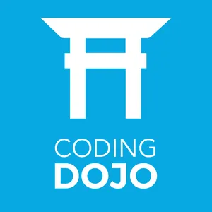
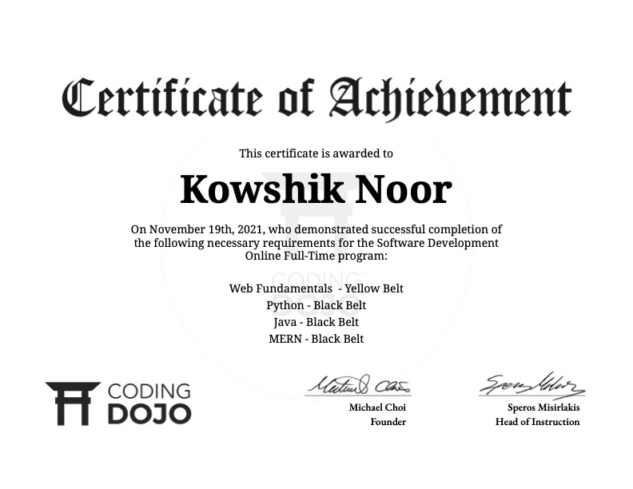

# CodingDojo

    

This is all of the work I did during my time in the Coding Dojo.
Coding Dojo is a bootcamp in which I learned how to make full-stack web applications in Java, Python, and MERN. All in a span of 14 weeks.

I also learned how to deploy these webapps using technnologies such as AWS and NGINX.

I graduated the bootcamp with the highest of honors (a triple black belt).

    

